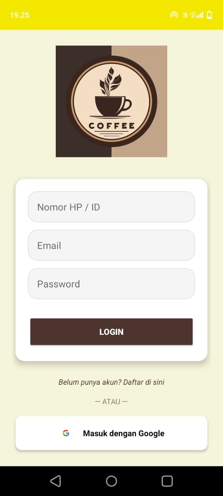
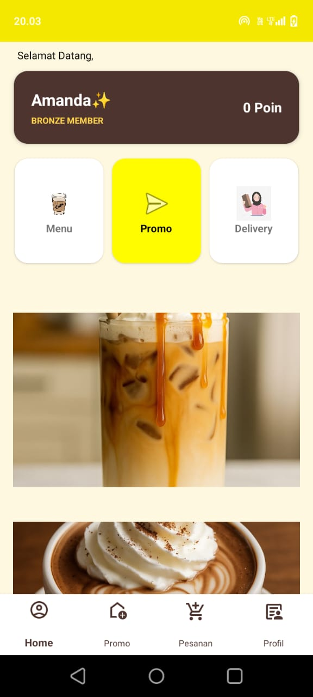
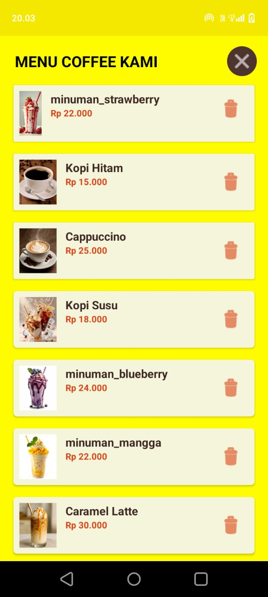
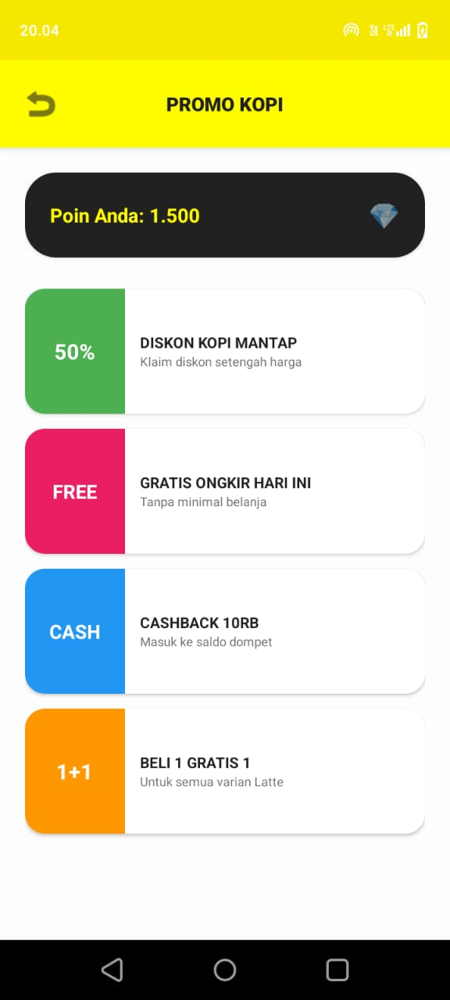
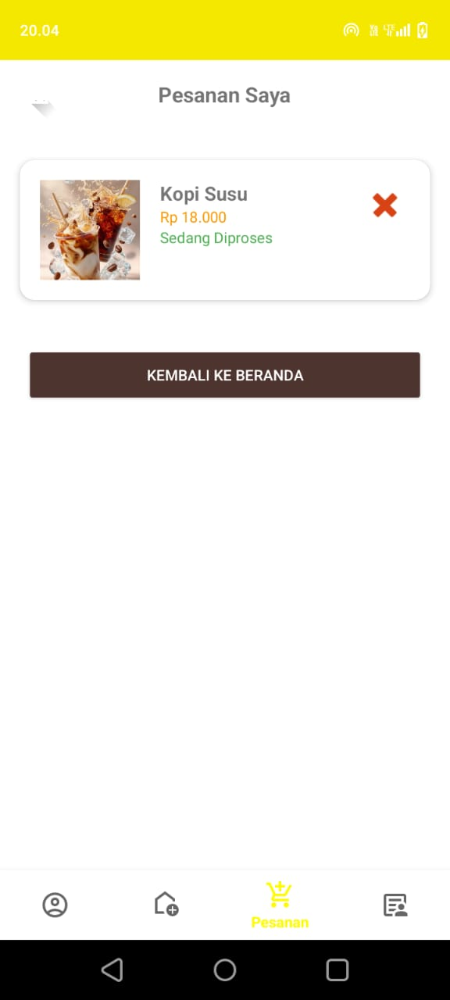
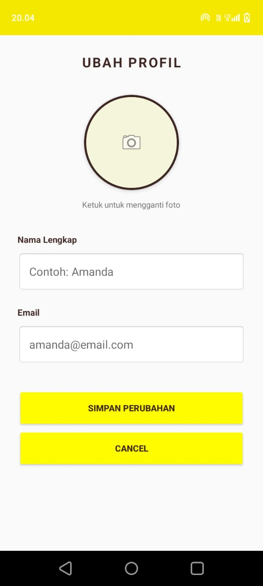
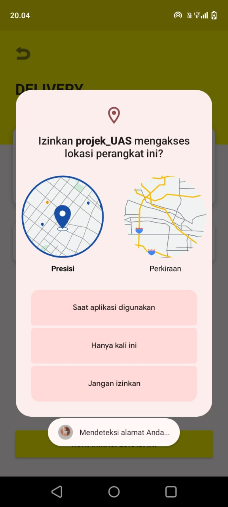
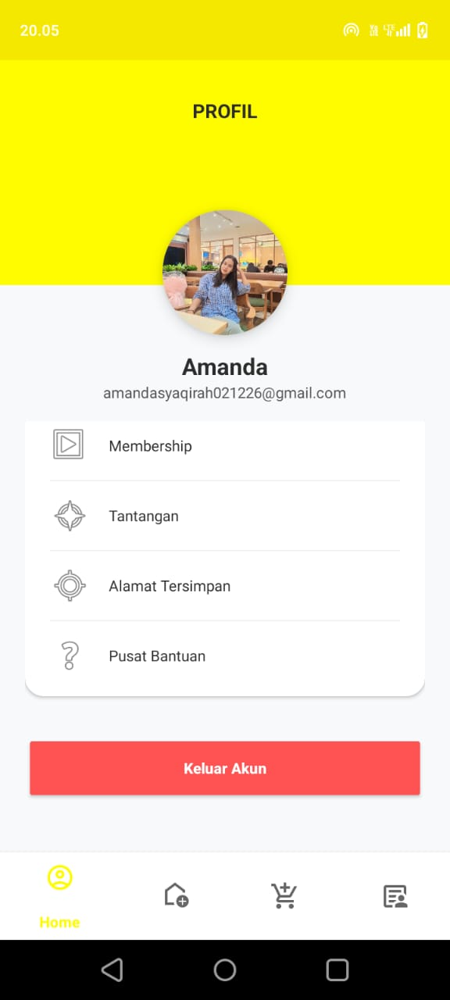
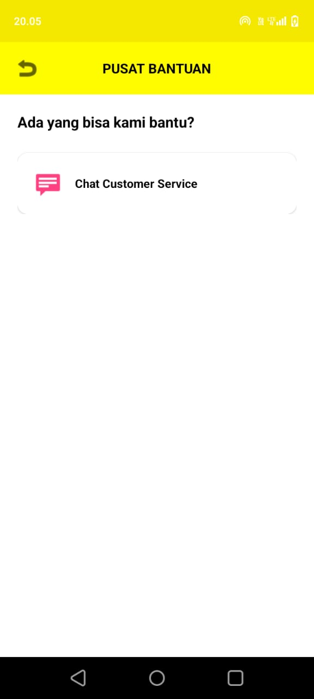

# Tugas Akhir – Aplikasi Coffee shop

## 1. Identitas Mahasiswa
- **Nama**: Amanda  
- **NIM**: 2304411456  
- **Kelas**: 5I RPL1  

---

## 2. Deskripsi Aplikasi
Aplikasi  **Flash Coffee** merupakan platform pemesanan kopi berbasis digital yang terinspirasi dari aplikasi Flash Coffee.  
Aplikasi ini terintegrasi dengan sistem pembayaran cashless serta manajemen loyalty.

Pengguna dapat melakukan pemesanan *grab-and-go* tanpa harus mengantre, menikmati promo eksklusif, serta mengumpulkan poin reward dari setiap pembelian menu kopi premium.

- **Aplikasi Rujukan**: Flash Coffee https://play.google.com/store/apps/details?id=com.flashcoffee

---

## 3. Fitur Utama
- **Firebase Integration**  
  Sinkronisasi data menu, harga, dan pesanan secara real-time menggunakan Firebase.

- **Horizontal Scrolling (RecyclerView)**  
  Menampilkan promo terbaru, rekomendasi kopi best-seller, serta kategori menu secara horizontal.

- **Detail Menu**  
  Menampilkan deskripsi varian kopi, pilihan customization, serta penggunaan library **Glide** untuk memuat gambar produk resolusi tinggi.

- **SharedPreferences**  
  Menyimpan preferensi pengguna seperti riwayat pesanan terakhir dan lokasi yang tersimpan.

- **Admin Dashboard**  
  Panel admin untuk mengelola stok bahan, mengubah status pesanan, serta menambahkan menu musiman (*seasonal drinks*).

- **Filter Category**  
  Memudahkan pengguna memfilter menu berdasarkan kategori seperti **Essential Coffee**, **Non-Coffee**, dan **Ice Shaken**.

---

## 4. Tangkapan Layar
Tambahkan screenshot aplikasi di folder `/screenshots`  
 Contoh:
#### Login & dashboard

  
  

#### menu & promo

  
  

#### pesanan & ubahprofil

  
  

#### delivery & profil & pusatbantuan

  
  
  

 
 
---

## 5. Cara Menjalankan Aplikasi
1. **Login atau Daftar Akun**  
   Pengguna dapat login menggunakan email atau Google.  
   Jika belum memiliki akun, pilih menu *Belum Punya Akun* lalu isi nomor HP, email, dan password.

2. **Masuk ke Halaman Utama**  
   Setelah login berhasil, pengguna akan diarahkan ke halaman utama aplikasi.

3. **Pilih Lokasi Toko**  
   Pengguna memilih gerai Flash Coffee terdekat atau lokasi pengambilan pesanan.

4. **Pilih Menu**  
   Pengguna memilih minuman atau menu kopi yang ingin dipesan.

5. **Halaman Pesanan**  
   Pesanan yang dipilih akan masuk ke halaman pesanan dan menampilkan status:
   - Dibuat
   - Diproses
   - Diantarkan

6. **Ambil Pesanan / Pembayaran**  
   Jika status pesanan sudah tiba, pengguna dapat mengambil pesanan dan melakukan pembayaran sesuai metode yang tersedia.

7. **Ubah Profil**  
   Pengguna dapat mengubah foto profil, nama, dan email pada halaman profil.

8. **Logout dari Aplikasi**  
   Pengguna dapat keluar dari akun melalui tombol **Keluar Akun** pada halaman profil.

